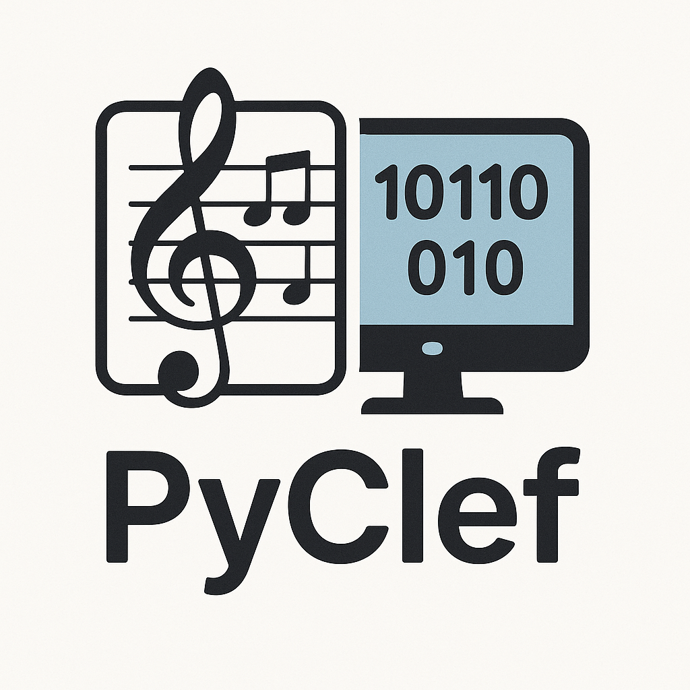

  

**PyClef** é uma ferramenta de código aberto desenvolvida com inteligência artificial e visão computacional para reconhecer partituras musicais a partir de imagens ou arquivos PDF, convertendo-as automaticamente em arquivos de áudio (`.mp3`) e MIDI (`.midi`). Utilizando algoritmos de ponta como o YOLO (You Only Look Once), PyClef tem como objetivo democratizar o acesso à música escrita e contribuir para sua preservação digital.

## 📌 Visão Geral

O reconhecimento óptico de partituras musicais (OMR - *Optical Music Recognition*) é um campo promissor impulsionado pelos avanços recentes em redes neurais convolucionais. O PyClef se propõe a:

- Automatizar a leitura de partituras físicas e manuscritas
- Transformar partituras visuais em som real (áudio) ou digital (MIDI)
- Facilitar o estudo, a inclusão e a digitalização de acervos musicais históricos

## 🎯 Objetivos do Projeto

- Reconhecer símbolos musicais (notas, claves, pausas) em imagens/PDFs de partituras
- Traduzir a notação musical para arquivos `.MIDI` e `.mp3`
- Desenvolver uma interface gráfica intuitiva (GUI)
- Tornar a ferramenta gratuita, acessível e personalizável para fins educacionais e acadêmicos
