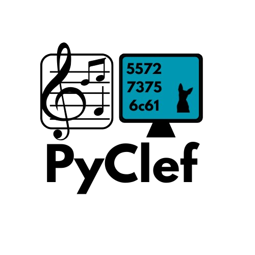

<p align="center">
  <picture>
    <source media="(prefers-color-scheme: dark)" srcset="pyclef_app/ui/logo_black.png">
    <source media="(prefers-color-scheme: light)" srcset="pyclef_app/ui/logo.png">
    
  </picture>
</p>

<h1 align="center">PyClef</h1>

<p align="center">
  <strong>Desktop Optical Music Recognition for annotations, MIDI, MP3, and synchronized video.</strong>
</p>

<p align="center">
  <a href="https://pypi.org/project/pyclef/"></a>
  
  
  
</p>

<p align="center">
  <a href="https://viniciusfs14.github.io/PyClef/">Website</a>
  |
  <a href="https://pypi.org/project/pyclef/">PyPI</a>
  |
  <a href="https://github.com/viniciusfs14/PyClef">Repository</a>
</p>

---

PyClef is a desktop Optical Music Recognition (OMR) tool for converting sheet music into annotated score pages, MIDI, MP3 audio, and synchronized video.

It combines neural symbol detection with staff-aware post-processing to make score recognition easier to inspect, hear, and review.

## Features

- PDF, PNG, JPG, and JPEG score input
- Annotated score image output
- MIDI export
- MP3 audio rendering
- Synchronized MP4 video preview
- Desktop interface with English and Portuguese support
- Automatic model download on first use

## Installation

Install PyClef from PyPI:

```bash
pip install pyclef
```

Then launch the desktop app:

```bash
pyclef
```

Or start it from Python:

```python
from pyclef import Pyclef

Pyclef()
```

## External Requirements

PyClef depends on a few external tools for full functionality.

### Poppler

PDF input is handled through `pdf2image`, which requires Poppler.

On Windows, install Poppler and make sure the Poppler `bin` directory is available. The default path used by PyClef is:

```text
C:\poppler\Library\bin
```

You can adjust this path in `pyclef_app/config.py` if needed.

### FFmpeg

MP3 and video generation use audio/video processing libraries that may require FFmpeg.

Make sure FFmpeg is installed and available in your system `PATH`.

## Model File

The YOLO model is not bundled inside the PyPI package because the file is large.

When PyClef starts processing a score, it looks for the model in this order:

1. `PYCLEF_MODEL_PATH`, if set.
2. The user cache folder at `~/.pyclef/models/best.pt`.
3. Automatic download from `PYCLEF_MODEL_URL`.

By default, `PYCLEF_MODEL_URL` points to:

```text
https://github.com/viniciusfs14/PyClef/releases/download/model-v1.0.0/best.pt.zip
```

If automatic download is available, PyClef will download and extract the model on first use.

For manual setup, place the model here:

```text
~/.pyclef/models/best.pt
```

Or set the environment variable:

```bash
PYCLEF_MODEL_PATH=/path/to/best.pt
```

On Windows PowerShell:

```powershell
$env:PYCLEF_MODEL_PATH="C:\path\to\best.pt"
pyclef
```

## Basic Workflow

1. Open PyClef.
2. Select a PDF or image score.
3. Choose the outputs you want to generate.
4. Set the BPM.
5. Run processing.
6. Open the generated result folder.

Each run creates a result folder named after the input file:

```text
results_score-name/
  score-name_annotated_p1.jpg
  score-name.mp3
  score-name.mid
  score-name.mp4
```

The generated files depend on the output options selected in the interface.

## Programmatic Usage

PyClef can also be called from Python:

```python
from pyclef import process_score_files

result = process_score_files(
    file_list=["score.pdf"],
    bpm=90,
    output_options={
        "annotations": True,
        "audio": True,
        "midi": True,
        "video": False,
        "language": "en",
    },
)

print(result)
```

Example return value:

```python
{
    "annotations": ["results_score/score_annotated_p1.jpg"],
    "audio": "results_score/score.mp3",
    "midi": "results_score/score.mid"
}
```

## Research Context

PyClef is part of an Optical Music Recognition research workflow focused on turning object detection results into usable musical output.

The project uses MIRP, a staff-referenced musical inference method, to reconstruct pitch from detected symbols using staff geometry and clef context.

Project website:

```text
https://viniciusfs14.github.io/PyClef/
```

## Current Status

PyClef is under active development.

The current version is suitable for experimentation, demonstrations, and research-oriented score processing. Recognition quality can vary depending on scan quality, notation density, and symbol detection performance.

## License

See the repository license for usage terms.
